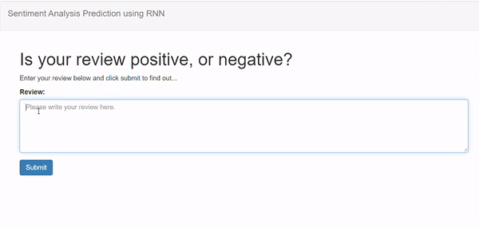

# Deploying Sentiment analysis model using Amazon SageMaker

This is the final solution of the project 'Sagemaker Deployment' which consists in deploying a Sentiment Analysis model using RNN in the Amazon AWS SageMaker tool. The notebook and Python files provided here result in a simple web app which interacts with a deployed recurrent neural network performing sentiment analysis on movie reviews.

In the final architecture AWS API Gateway and AWS Lambda functions is used as well. The application architecture diagram is:

 

## Web app final result

The final project will be executed in a simple html page which can be deployed anywhere.

 

## Software and Libraries

This project uses the following software and Python libraries:

- Python
- NumPy
- pandas
- PyTorch
- Amazon SageMaker
- NLTK

